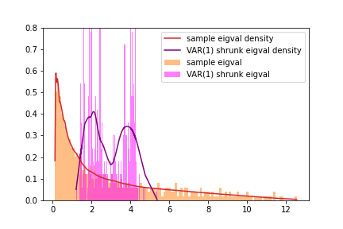

# Shrinkage cleaning of large correlation matrices

This library provides tools useful for cleaning ("shrinking") statistical noise present in estimators of correlation matrices encountered in diverse fields of science, in the "big data regime", where the number of collected samples and the number of correlated entities are both large and of comparable size. It is based on ideas from random matrix theory.

## Description

A very generic problem in experimental research is the following: we observe _N_ entities, collecting in the process _T_ samples for each of them; from this dataset, we are interested in estimating the _correlation matrix_ between the entities under investigation.

In the regime where _N_ is much smaller than _T_, i.e. when we have many more statistical samples than entities, usual multivariate statistical methods apply. In particular, the standard _sample estimator_ (or, Pearson correlation coefficient) is optimal, and may very well be used. However, if the number of entities _N_ becomes large and of comparable size with _T_, these well-known techniques fail to capture the underlying truth of the data-generating process: the amount of _noise_ (variance) in the sample estimators completely obscures the parameters being estimated.

This situation is commonly encountered in fields such as quantum chromodynamics, cosmology, genomics and bioinformatics, acoustics and signal processing, image processing, neuroscience, cancer research, and many others.

This _big data regime_ requires therefore different tools, and in fact, a potent mathematical framework of _random matrix theory_ comes to the rescue: it allows to derive better estimators of the correlation matrix, where the noise is "cleaned", and the underlying truth more visible. They are called _shrinkage estimators_.

There are several flavors of them, depending on a general structure one chooses to model the data with. Historical milestones include the _Ledoit-Wolf linear shrinkage_ and the _Ledoit-Péché nonlinear shrinkage_. There are also more complicated versions, allowing for instance for correlations between the collected samples.

This library is designed to be a user-friendly source of both theoretical knowledge on the topic, as well as an easy-to-use code base for both creating new shrinkage solutions, and applying shrinkage tools to both simulated and real-world datasets.

## Getting Started

A good entry point to the library is the detailed _User's Guide_, a Jupyter notebook `shrinkage_user_guide.ipynb`. It includes a theoretical background, as well as extensive code examples.

For an in-depth understanding of how shrinkage of large correlation matrices works, explore scientific articles located in the directory `papers`.

## Authors

Andrzej Jarosz

## Version History

- 1.0.0
  - Initial Release

## License

This project is licensed under the MIT License - see the `LICENSE.md` file for details.
